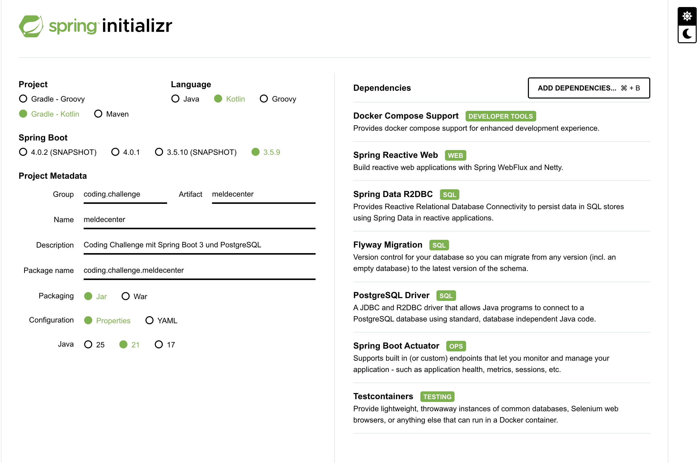

# Meldecenter

Dies ist eine Coding-Challenge-Anwendung, die mit Spring Boot 3 und PostgreSQL entwickelt wurde.



## Voraussetzungen

### JDK Installation
Es wird empfohlen, eine JDK 21 über [SDKMAN!](https://sdkman.io/) zu installieren, z.B.:

```bash
sdk install java 21.0.9-zulu
```
*(Verfügbare Versionen von JDK 21 können über `sdk list java` abgerufen werden.)*

Oder `sdk env install` ausführen, dabei wird die JDK von [.sdkmanrc](.sdkmanrc) installiert:

```bash
sdk env install
```

### Docker Installation
Es wird empfohlen, [OrbStack](https://orbstack.dev/) oder [Docker Desktop](https://www.docker.com/products/docker-desktop) zu installieren.

`docker` und `docker compose` Befehle werden benötigt.

## Anwendung ausführen

Es gibt zwei Möglichkeiten, die Anwendung zu starten:

### 1. Docker-Modus
```bash
./gradlew composeUp
```
Dieser Befehl baut das Boot-Jar-Archiv und startet die gesamte Umgebung (Anwendung, Datenbank, FTP-Server) mithilfe von Docker Compose im Hintergrund (`-d`). Die Anwendung läuft dann in einem Container.

### 2. Entwicklungs-Modus
```bash
./gradlew bootRun
```
Dies startet die Anwendung lokal über Gradle. Dank der Spring Boot Docker Compose Integration werden die notwendigen Infrastruktur-Dienste (PostgreSQL, FTP) automatisch aus der `compose.yaml` gestartet, während die Anwendung selbst nativ auf Ihrem Host-System läuft. Dies ist ideal für die Entwicklung und das Debugging.

## Port-Belegung an localhost

| Anwendung / Dienst | Port (Localhost) | Port (Container) | Protokoll / Zweck |
| :--- | :--- | :--- | :--- |
| **Meldecenter** | `8080` | `8080` | REST API |
| **PostgreSQL** | `5432` | `5432` | Datenbank (R2DBC/JDBC) |
| **FTP Server** | `2121` | `21` | FTP Control Port |
| **FTP Server** | `21001` | `21000` | FTP Passive Data Port |
| **Jaeger UI** | `16686` | `16686` | Web-Oberfläche (Tracing) |
| **Jaeger OTLP** | `4317` | `4317` | Tracing via gRPC |
| **Jaeger OTLP** | `4318` | `4318` | Tracing via HTTP |


## Tests ausführen

Um die Unit- und Integrationstests auszuführen, verwenden Sie:

```bash
./gradlew test
```

**Wichtig:** Damit die Tests lokal erfolgreich ausgeführt werden können, müssen die Ports **21** (FTP) und **21000** (FTP Passive Ports) auf Ihrem System frei sein, da Testcontainers diese für den integrierten FTP-Server benötigt.

## Weitere Dokumentation

- [Details zum XML-Mapping](src/test/resources/README.md)
